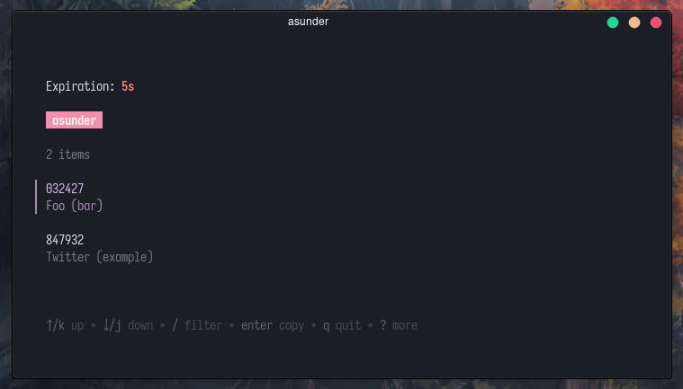

# asunder

> Asunder, Sweet and Other Distress

A pretty, little two-factor authenticaton _(2FA)_ client for the command line. 🍡

## Installation

### Binaries

Download a binary from the [releases](https://github.com/fawni/asunder/releases)
page.

### Build from source

Go 1.20 or higher required. ([install instructions](https://golang.org/doc/install.html))

    go install github.com/fawni/asunder@latest

## Usage

The first time you run asunder you will be asked to create a master password.
After that, everytime asunder is launched you will be prompted for that password.

Add entries:

    asunder add

Start asunder:

    asunder

Delete entries:

    asunder delete

## TODO

- [ ] Export database
- [ ] Import from other authenticators

## License

[OSL-3.0](LICENSE)
